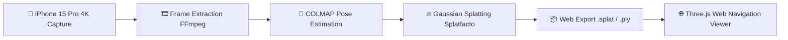

# 📚 Namma Space - Documentation Center

Welcome to the documentation for **Namma Space**, a 3D Indoor Navigation System developed for the **IIT Bombay Techfest 2026-27 Competition**.

---

## 📑 Document Directory

| Document | Description | Target Audience |
| :--- | :--- | :--- |
| 🚀 [**Quickstart Guide**](quickstart.md) | 5-minute setup and walkthrough from video to 3D viewer | Beginners / Quick setup |
| 📱 [**Capture SOP (Standard Operating Procedure)**](capture_sop.md) | Guidelines for recording high-quality indoor videos on iPhone 15 Pro | Capture / Field operators |
| ⚙️ [**How It Works**](how_it_works.md) | Deep dive into COLMAP, Nerfstudio, Splatfacto, and Gaussian Splatting | Developers & Engineers |
| 🎛️ [**Training Options**](training_options.md) | Fast vs quality training presets, Apple Silicon optimizations, and flags | Machine Learning / Training |
| 🔧 [**Troubleshooting Guide**](troubleshooting.md) | Solutions for COLMAP registration errors, OOM crashes, and viewer issues | Debugging |
| 🏆 [**Competition Guide (Markdown)**](competition_guide.md) | Full competition strategy, milestones, submission checklists, and roadmap | Project Leads / Reviewers |
| 🌐 [**Interactive Competition Guide (HTML)**](competition_guide.html) | Rich HTML version of the complete competition roadmap | Browser presentation |
| 📜 [**Competition Problem Statement (PDF)**](competition_problem_statement.pdf) | Official IIT Bombay Techfest problem statement & rules | Reference |
| 📝 [**Project Context & History**](project_context.md) | Development logs, hardware benchmarks (M5 Max), and session notes | Reference |

---

## 🧭 Navigation Pipeline Overview

For script details and automation commands, see [Scripts Documentation](../scripts/README.md).
